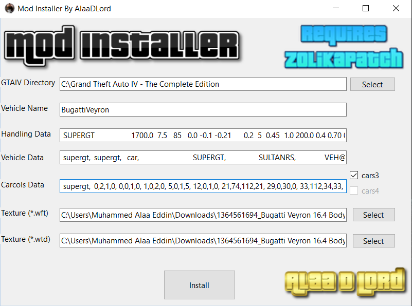

# Vehicle Mod Installer for GTA IV

## Description

The Vehicle Mod Installer for GTA IV is a comprehensive tool designed to simplify the process of adding and managing custom vehicles in Grand Theft Auto IV. This installer ensures compatibility and stability, requiring the use of essential patches and tools developed by the GTA modding community. Follow the instructions below to set up the necessary components for a seamless modding experience.

## ScreenShots

## Installation Guide

### Step 1: Install ZolikaPatch

1. Visit the [ZolikaPatch forum thread](https://gtaforums.com/topic/955449-iv-zolikapatch/).
2. Download the latest version of ZolikaPatch.
3. Extract the contents of the downloaded archive.
4. Copy the files to your GTA IV installation directory, replacing any existing files.

### Step 2: Install Zolika1351's Trainer/Mod Menu

1. Visit the [Zolika1351's Trainer/Mod Menu forum thread](https://gtaforums.com/topic/896795-1000-1080-zolika1351s-trainermod-menu-rewritten/).
2. Download the latest version of the Trainer/Mod Menu.
3. Extract the contents of the downloaded archive.
4. Copy the files to your GTA IV installation directory, replacing any existing files.

### Step 3: Install IV Tweaker (Modloader and Limit Adjuster)

1. Visit the [IV Tweaker forum thread](https://gtaforums.com/topic/979531-iv-tweaker-modloader-limit-adjuster-for-gta-iv).
2. Download the latest version of IV Tweaker.
3. Extract the contents of the downloaded archive.
4. Copy the files to your GTA IV installation directory, ensuring that all files are placed correctly.

## Features

- **Easy Vehicle Installation**: Simplifies the process of adding new vehicles to GTA IV.
- **Enhanced Compatibility**: Ensures all installed mods work together seamlessly with essential patches.
- **Custom Mod Management**: Utilize Zolika1351's Trainer/Mod Menu for additional modding options and in-game tweaks.
- **Stability Enhancements**: Leverages IV Tweaker for improved game stability and performance.

## Notes

- Make sure to back up your original game files before installing any mods.
- Ensure you have the latest version of each required component to avoid compatibility issues.
- Follow the instructions carefully to ensure proper installation and functionality.

Happy modding! Enjoy your enhanced GTA IV experience with new vehicles and features.
